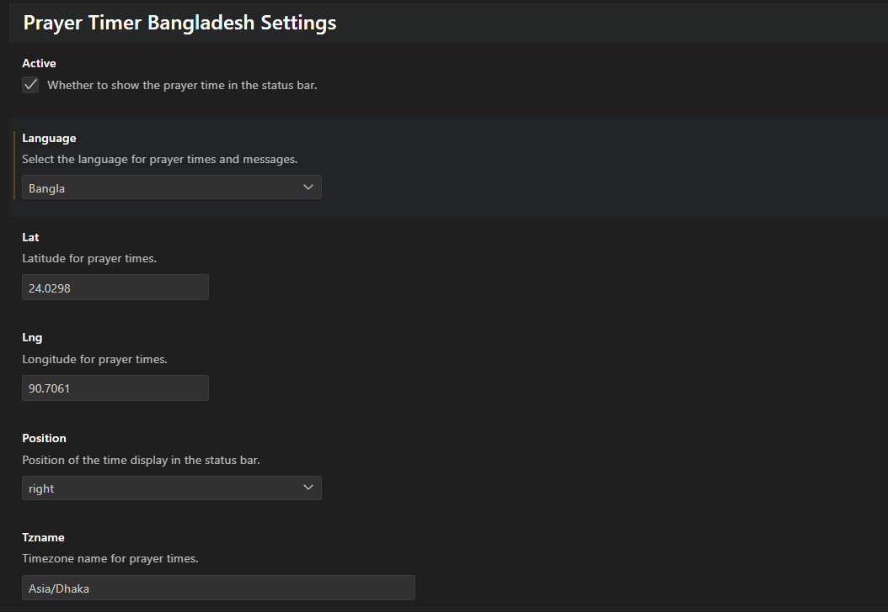
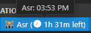

# Prayer Timer Bangladesh


**[Prayer Timer Bangladesh](https://marketplace.visualstudio.com/items?itemName=azmolla.prayer-timer-bangladesh)** extension for Visual Studio Code provides an easy and convenient way to track prayer times based on your GPS location in Bangladesh. With dynamic GPS-based prayer times and a customizable interface, you can keep track of prayer times seamlessly while working.

## Features

- **Dynamic GPS-Based Prayer Times**: Automatically retrieves prayer times based on your current latitude and longitude.

- **Customizable Settings**:
  - Set Default Language (Currently: English and Bangla)
  - Configure default latitude and longitude for your location.
  - Set the timezone (default: `Asia/Dhaka`).
  - Choose the position of prayer times in the status bar (`left` or `right`).
  - Toggle visibility of prayer times in the status bar.

  

- **Commands**:
  - `Display Prayer Times`: Shows current prayer time in the status bar.
  - `Show All Prayer Times`: Displays all prayer times in a list.

  

- **Notifications**
  - 
  - 
  - 
  
- **Status Bar Integration**: Seamlessly displays the current prayer time in the status bar without disrupting your workflow.

  
  

- **Show All Prayer Times**: By Clicking on the status bar item, you can see all prayer times in a list.

  
  

- **Islamic Foundation Bangladesh Prayer Timer**: By runing the command `Show Today's Islamic Foundation Prayer Timer` you can see todays prayer time given by islamic foundation.

  

## Installation

1. **Install via Marketplace**:
   - Open Visual Studio Code or VSCodium.
   - Go to the Extensions view by clicking on the Extensions icon in the Activity Bar.
   - Search for **Prayer Timer Bangladesh** and click **Install**.

   

   Or visit the extension [on the VSCode Marketplace](https://marketplace.visualstudio.com/items?itemName=azmolla.prayer-timer-bangladesh) or [on the Open VSX Marketplace](https://open-vsx.org/extension/azmolla/prayer-timer-bangladesh).

2. **Install from Source**:
   - Clone the repository:
     ```bash
     git clone https://github.com/abiruzzamanmolla/prayer-timer-bangladesh.git
     ```
   - Navigate to the directory:
     ```bash
     cd prayer-timer-bangladesh
     ```
   - Install dependencies and compile:
     ```bash
     npm install
     npm run compile
     ```
   - Launch the extension:
     ```bash
     npm run watch
     ```

## Usage

### Commands

- **Display Prayer Times**:
  - Command: `prayer-timer-bangladesh.showPrayerTimes`
  - Shows the current prayer time in the status bar.

- **Show All Prayer Times**:
  - Command: `prayer-timer-bangladesh.showAllPrayerTimes`
  - Displays a list of all prayer times.

- **Show Hadith Notification**:
  - Command: `prayer-timer-bangladesh.showHadith`
  - Show a random Hadith.

- **Clean Prayer Timer from Memory**:
  - Command: `prayer-timer-bangladesh.resetPrayerTimes`
  - Description: Clears the stored prayer times and location information from memory and resets the timer.

  
- **Show Islamic Foundation Prayer Time**:
  - Command: `prayer-timer-bangladesh.showBdPrayerTimes`
  - Description: Show today's islamic foundation local (dhaka) prayer timer.

### Configuration

You can configure the extension by editing your `settings.json` file in VS Code. Available settings:

```json
{
  "prayerTimerBangladesh.lat": 24.0298,
  "prayerTimerBangladesh.lng": 90.7061,
  "prayerTimerBangladesh.tzname": "Asia/Dhaka",
  "prayerTimerBangladesh.position": "right",
  "prayerTimerBangladesh.active": true,
  "prayerTimerBangladesh.language": "English",
}
```

### Settings Breakdown

| Setting | Type | Default | Description |
| --- | --- | --- | --- |
| `prayerTimerBangladesh.language` | enum | `English` or `Bangla` | Change the language of the texts. |
| `prayerTimerBangladesh.lat` | number | 24.0298 | Latitude for prayer times. |
| `prayerTimerBangladesh.lng` | number | 90.7061 | Longitude for prayer times. |
| `prayerTimerBangladesh.tzname` | string | `Asia/Dhaka` | Timezone for prayer times. |
| `prayerTimerBangladesh.position` | string | `right` | Position of prayer times in the status bar. |
| `prayerTimerBangladesh.active` | boolean | `true` | Toggle visibility of prayer times in the status bar. |

## Screenshots

- **Status Bar**: Display of prayer times on the status bar (either on the left or right). Take a screenshot of your VS Code window showing prayer times in the status bar.
- **Command Palette**: A screenshot of the Command Palette with the extension's commands (search for `Prayer Timer`).

## Development

To contribute or make changes, follow these steps:

1. Clone the repository: `git clone https://github.com/abiruzzamanmolla/prayer-timer-bangladesh.git`
2. Install dependencies: `npm install`
3. Compile the TypeScript files: `npm run compile`
4. Watch for changes: `npm run watch`

### Scripts

- **Compile**: `npm run compile` – Compiles TypeScript files.
- **Watch**: `npm run watch` – Watches for changes and automatically recompiles.
- **Lint**: `npm run lint` – Runs ESLint for code quality checks.
- **Test**: `npm run test` – Runs the extension's tests.

## Repository

For more information, visit the [GitHub repository](https://github.com/abiruzzamanmolla/prayer-timer-bangladesh).

## License

This project is licensed under the MIT License. See the [LICENSE](LICENSE) file for more details.

## Developer Links

- [GitHub Profile](https://github.com/abiruzzamanmolla)
- [LinkedIn Profile](https://www.linkedin.com/in/abiruzzamanmolla/)
